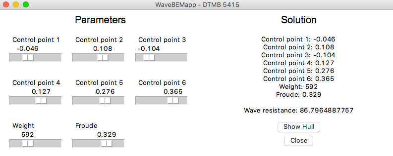

# WaveBEMapp-DTMB-5415
This repository presents a proof of concept for the submitted paper *Dimension reduction in heterogeneous parametric spaces: a naval engineering case*, whose authors are: Marco Tezzele, Filippo Salmoiraghi, Andrea Mola and Gianluigi Rozza.

It is essentially a GUI that allows you to change 8 parameters and get in real time the approximated total wave resistance of the DTMB-5415 hull advancing in calm water. It shows you the deformed hull from three different views and saves it in iges format.

The reduction of the parameters psace is done via the **active_subspaces** package, the deformation of the hull with **PyGeM**, while the solver is **WaveBEM**. You can find the repositories of the last two inside the mathLab organization page. **OCC** is used to visualize the deformed hull.

The error committed in the computation of the total wave resistance is below 5%.

Here we have a screenshot of the app:




## Dependencies and installation
**WaveBEMapp-DTMB-5415** requires `Tkinter`, `PIL`, `logging` and `matplotlib`. They can be easily installed via `pip`. 
Moreover **WaveBEMapp-DTMB-5415** depends on `OCC == 0.17`, `PyGeM` and `active_subspaces`. These requirements cannot be satisfied through `pip`.
Please see the table below for instructions on how to satisfy the requirements.

| Package | Version  | Comment                                                                    |
|---------|----------|----------------------------------------------------------------------------|
| OCC     | == 0.17  | See pythonocc.org or github.com.tpaviot/pythonocc-core for instructions or `conda install -c https://conda.anaconda.org/dlr-sc pythonocc-core==0.17` |
| PyGeM     | == 1.0   | Simplest solution is `git clone https://github.com/mathLab/PyGeM` and `python setup.py install` |
| active_subspaces     | == 0.1   | Simplest solution is `git clone https://github.com/paulcon/active_subspaces.git` and `python setup.py install` |


The official distribution is on GitHub, and you can clone the repository using

```bash
> git clone https://github.com/mathLab/WaveBEMapp-DTMB-5415
```

To run the app just type:

```bash
> python app.py
```